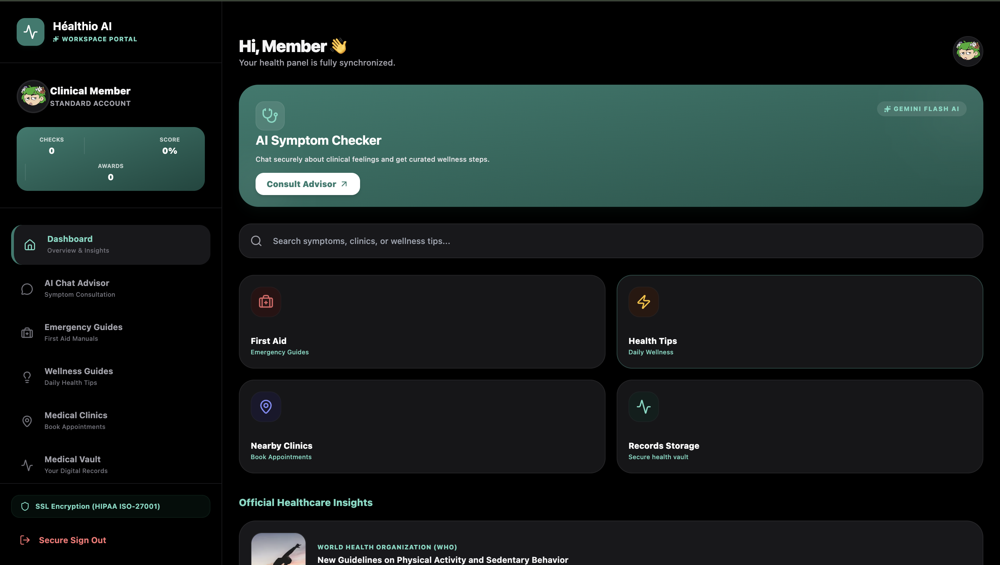

Introduction

HealthIO is a modern healthcare platform that helps users manage their health records, book appointments, and access healthcare services through a simple, secure, and user-friendly dashboard.

Description

HealthIO streamlines healthcare by bringing essential medical services and personal health information into one convenient platform, making it easier to stay connected with healthcare providers.

Features
🩺 Patient health records management
📅 Appointment scheduling
👨‍⚕️ Doctor and patient dashboard
🔒 Secure user authentication
📱 Responsive and user-friendly interface
📊 Health information tracking
⚡ Fast and easy navigation
